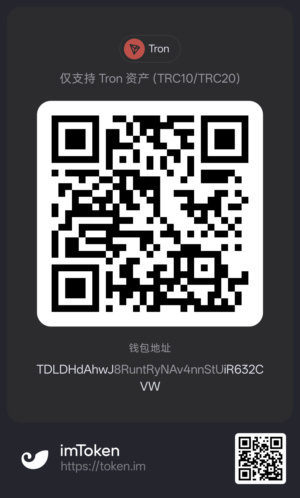

# Support Pixel Diffusion

If Pixel Diffusion saves you time, consider supporting maintenance with a coffee.

## Ways to support

| Channel | Best for | Link |
| --- | --- | --- |
| GitHub Sponsors | Monthly / one-time, visible on the repo | https://github.com/sponsors/ganjmeng |
| Product support page | WeChat Pay + crypto QR, all options in one place | https://pixel-diffusion.com/support |
| Crypto (Tron) | USDT / TRX on TRC10/TRC20 | Address below |
| Issues / PRs | Non-financial support, equally valuable | https://github.com/ganjmeng/wanxiangzy/issues |

Contact: [178153955@qq.com](mailto:178153955@qq.com).

## WeChat Pay

Scan with WeChat to buy the maintainer a coffee:

  

<b>Thank you for supporting open source.</b>

## Crypto (Tron)

USDT / TRX on the **Tron network only (TRC10/TRC20)**. Assets sent on the
wrong network cannot be recovered.

  

<code>TDLDHdAhwJ8RuntRyNAv4nnStUiR632CVW</code>

- Verify the address before sending: it starts with `TDLD` and ends with `CVW`.
- Crypto transfers are irreversible and cannot be refunded through GitHub.

## Notes

- Sponsorship does not change the [AGPL-3.0](../LICENSE) license.
- Sponsorship does not buy project control, priorities, or feature commitments.
- Prefer GitHub Sponsors for auditable, refundable payments. A personal
  payment QR is convenient but cannot be audited or refunded through GitHub.
- If you need an invoice or enterprise support, open a
  [discussion issue](https://github.com/ganjmeng/wanxiangzy/issues) first.

## Adding new channels

When Afdian / Buy Me a Coffee / Ko-fi / Stripe Payment Links are ready:

1. Add the URL to [.github/FUNDING.yml](../.github/FUNDING.yml).
2. Add the badge + link to `README.md` / `README.zh-CN.md` Support sections.
3. Add the option to `app/support/page.tsx`.
4. Keep this file as the single source of truth for support copy.
