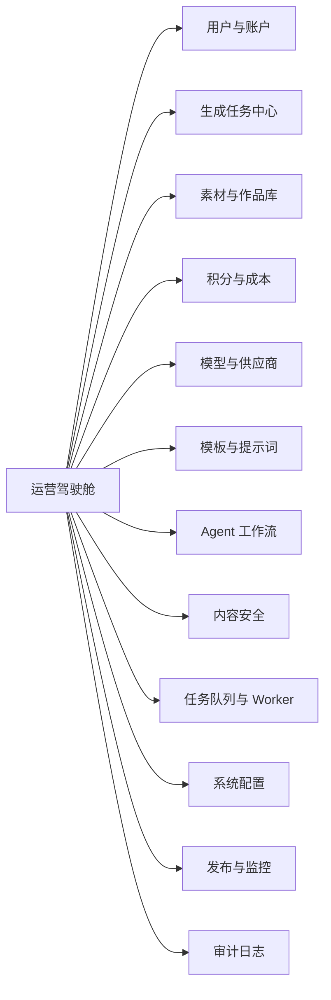
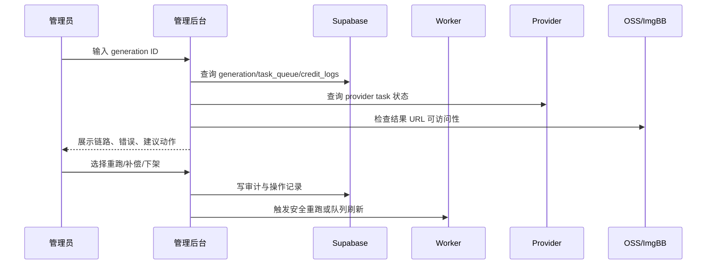

# 万象衣造产品管理后台 PRD

版本：v0.1  
日期：2026-05-18  
目标阶段：生产可上线版 V1  
适用产品：万象衣造 AI / VastWearGen

## 1. 背景

万象衣造当前已经覆盖多条 AI 视觉生成链路：服装上身、模特生成、姿势裂变、换脸、换背景、商品套图、种草图、服装 3D、通用生图、Agent 多步骤工作流、积分扣费、任务队列、历史作品、素材存储、模型供应商、质量评估与自动修复。

现有能力主要面向用户端和后台处理器，运营、客服、审核、财务和工程排障仍依赖数据库、日志、手动脚本和 GitHub/EC2 发布链路。产品管理后台的目标是把所有关键业务链路产品化，让内部团队能安全、高效、可审计地完成日常管理。

## 2. 产品目标

1. 覆盖所有业务链路：从用户注册、上传素材、创建生成、积分扣费、任务执行、模型调用、结果存储、内容审核、历史作品、售后处理到部署监控。
2. 降低人工排障成本：管理员可以在 3 分钟内定位单个用户、单个任务、单个 provider 请求或一次积分异常。
3. 提升运营可控性：模型开关、积分价格、模块展示、预设模板、风控策略、内容下架都可以在后台完成，并有审批和审计。
4. 达到生产可上线标准：RBAC、审计日志、危险操作二次确认、可回滚配置、WCAG 2.2 AA、数据脱敏、性能指标和监控告警齐备。

## 3. 成功指标

| 指标 | V1 目标 |
| --- | --- |
| 单任务定位时间 | P95 小于 3 分钟 |
| 用户积分争议处理时间 | P95 小于 5 分钟 |
| 生成失败人工补偿处理时间 | P95 小于 5 分钟 |
| 后台关键页面加载 | 首屏 P95 小于 2 秒，表格筛选 P95 小于 1 秒 |
| 运营配置误操作 | 0 起无审计、0 起不可回滚 |
| 内容下架链路 | 2 分钟内完成下架并阻断再次展示 |
| 可访问性 | WCAG 2.2 AA 验收通过 |

## 4. 用户角色与权限

| 角色 | 典型用户 | 权限边界 |
| --- | --- | --- |
| Super Admin | 创始人、技术负责人 | 全部权限，含权限分配、生产配置、危险操作 |
| Ops Admin | 运营负责人 | 模块配置、预设、活动、内容管理、任务干预 |
| Support | 客服 | 用户查询、任务查询、补偿申请、只读日志 |
| Finance | 财务 | 积分流水、成本报表、手动调账审批 |
| Content Reviewer | 内容审核 | 素材/结果查看、标记、下架、封禁建议 |
| ML/Provider Operator | 模型运营 | provider 配置、模型开关、成本、失败率、降级策略 |
| Engineer | 工程/运维 | 任务队列、worker、Redis、存储、部署状态、错误日志 |
| Auditor | 审计 | 只读所有审计日志、配置版本、导出记录 |

权限模型采用 RBAC + 操作级权限点。所有写操作必须进入 `admin_audit_logs`。高危操作需要原因、二次确认和可回滚记录。

## 5. 设计原则

1. 工作台优先，不做营销页。首页就是运营驾驶舱和异常处理入口。
2. 高信息密度但不拥挤。核心使用表格、筛选器、分栏详情、状态徽标、批量操作，不用大面积装饰卡片。
3. 所见即链路。每个任务详情必须能跳到用户、积分、素材、provider 请求、结果图、质量评估、日志和审计记录。
4. 危险动作显式化。退款、重跑、下架、封禁、切 provider、发布配置都需要原因、影响预览和审计。
5. 现代后台审美。中性色基底、清晰层级、8px 以内圆角、紧凑数据表、右侧 inspector、命令面板、键盘快捷操作、可读状态色。
6. 可访问性内建。遵循 WCAG 2.2 AA：键盘可操作、焦点可见、非颜色唯一表达、足够对比度、状态消息可被读屏识别。

## 6. 信息架构

一级导航建议：

1. 总览
2. 用户
3. 任务
4. 素材
5. 作品
6. 积分
7. 模型
8. 模板
9. Agent
10. 审核
11. 系统
12. 监控
13. 审计

全局能力：

- 全局搜索：用户 ID、邮箱、generation ID、workflow ID、图片 URL、provider task ID。
- 命令面板：`Ctrl/⌘ + K`，支持跳转页面、查任务、查用户、创建补偿单、打开最近错误。
- 右侧详情抽屉：所有列表行点击后不离开列表，右侧展示详情和操作。
- 全局时间范围：今天、7 天、30 天、自定义，影响驾驶舱和报表。
- 环境切换：Production、Staging、Local，只读展示当前环境，禁止误操作。

## 7. 端到端链路覆盖

| 业务链路 | 当前实体/接口 | 后台管理能力 |
| --- | --- | --- |
| 注册与资料 | `profiles`, Supabase Auth | 用户搜索、状态、注册来源、积分余额、风险标签、封禁/解封 |
| 积分扣费 | `credits`, `credit_logs`, RPC | 流水查询、扣费核查、人工补偿、退款审批、异常余额报警 |
| 上传素材 | `/api/upload-image`, OSS/ImgBB | 素材列表、归属用户、大小、类型、存储 provider、删除/冻结 |
| 生成提交 | `/api/tryon`, `/api/pose`, `/api/model` 等 | 按模块查看提交参数、成本、状态、输入图、提示词 |
| 后台执行 | `/api/jobs/process-generations` | worker 状态、认领队列、重试、卡住任务释放 |
| Provider 调用 | `lingya.ts`, Plato/LaoZhang/Yunwu | provider 健康、失败率、模型路由、成本、限流、熔断 |
| 任务队列 | `task_queue_items`, Redis cache | 队列延迟、模块队列、重建索引、缓存命中、异常任务 |
| 质量评估 | visual quality / auto regenerate | 评分、问题、自动修复记录、人工通过/驳回 |
| 结果存储 | `result_urls`, `image-storage.ts` | 结果图检查、失效 URL 修复、迁移、下架 |
| 历史作品 | `/api/history`, `generations` | 作品详情、应用参数、重新生成、隐藏/恢复 |
| 用户收藏 | tryon favorites, product-set favorites | 收藏素材/方案管理、违规移除 |
| Agent 对话 | `agent_conversations`, `agent_messages` | 对话查看、敏感内容标记、会话归档 |
| Agent 工作流 | `agent_workflows`, steps, selections | 步骤状态、人工跳过、重试、成本结算 |
| Agent 评估 | `agent_eval_runs`, `agent_eval_results` | eval 趋势、失败 case、上线门禁 |
| 内容安全 | 素材/结果/提示词 | 审核队列、违规标签、下架、封禁建议 |
| 发布部署 | Git tag -> GitHub Actions -> EC2 | 发布记录、tag、commit、构建状态、健康检查 |

## 8. 页面需求

### 8.1 总览 Dashboard

目标：让运营和工程 30 秒内知道今天是否健康。

核心模块：

- 今日生成量、成功率、失败率、平均耗时、自动修复率。
- 今日积分消耗、退款/补偿、provider 成本估算、毛利估算。
- 模块排行榜：tryon、pose、model、product-set、grass、faceSwap、garment3d、generalImage、agent。
- 异常队列：卡住任务、provider 错误、URL 失效、积分异常、审核待处理。
- Worker 状态：最近触发时间、处理数量、失败数量、延迟。
- 快捷操作：查用户、查任务、进入审核、重跑失败任务、切换 provider 降级策略。

验收标准：

- 指标可按环境和时间范围筛选。
- 所有异常卡片都能一键进入对应列表并保留筛选条件。
- 数据为空时显示下一步操作，不留空白表格。

### 8.2 用户与账户

列表字段：

- 用户 ID、邮箱、注册时间、最后活跃、积分余额、累计消耗、生成次数、失败率、风险等级、状态。

详情页：

- 用户基础资料、积分流水、任务历史、素材/作品、Agent 会话、登录设备、风控记录、客服备注。

操作：

- 调整积分：充值、扣减、冻结、释放；必须填写原因。
- 用户状态：正常、观察、限制生成、封禁。
- 导出用户数据：需要权限和审计。

验收标准：

- 任何积分变更都生成不可变审计记录。
- 客服不能直接大额调账，只能创建补偿申请。
- 用户敏感字段默认脱敏，点击查看需要二次确认。

### 8.3 生成任务中心

覆盖模块：

- 服装上身 `/create`, `/api/tryon`
- 模特生成 `/model`, `/api/model`
- 姿势裂变 `/pose`, `/api/pose`
- 换脸 `/face-swap`, `/api/face-swap`
- 换背景 `/model-background`, `/api/model-background`
- 商品套图 `/product-set`, `/api/product-set`
- 种草图 `/grass`, `/api/grass`
- 服装 3D `/garment-3d`, `/api/garment-3d`
- 通用生图 `/general-image`, `/api/general-image`

列表字段：

- generation ID、用户、模块、状态、进度、模型、尺寸、积分成本、provider task ID、结果数、提交时间、完成时间、耗时、错误摘要。

详情抽屉：

- 输入素材、结果图、最终提示词、原始参数、job_payload、provider 响应摘要、质量评估、自动修复、积分流水、任务队列索引、审计记录。

操作：

- 重新轮询 provider 状态。
- 重跑任务：原参数重跑、修改提示词重跑、只重跑失败子图。
- 标记完成/失败：仅工程权限。
- 补偿积分：创建申请或直接执行，依权限。
- 下架结果图：进入审核链路。
- 复制排障包：脱敏后复制任务上下文。

验收标准：

- 管理员能从任意 generation ID 定位到完整链路。
- 重跑必须生成新 generation 或 regeneration 记录，不覆盖原始结果。
- 超时任务不能直接视为失败；需区分前端轮询超时、worker 超时、provider 失败。

### 8.4 素材与作品库

素材库对象：

- 用户上传图、参考图、模特脸、服装图、站点资产、临时图、生成结果图、收藏图。

功能：

- 按用户、用途、模块、存储 provider、prefix、文件大小、上传时间、是否被引用筛选。
- 图片可访问性检查：HTTP 状态、MIME、大小、缩略图、跨域、OSS 参数。
- 生命周期管理：临时素材清理、孤儿文件识别、收藏素材保留。
- 批量操作：迁移到 OSS、冻结、删除、重新生成缩略图。

验收标准：

- 删除前展示引用影响：哪些 generation、favorite、workflow 仍引用该图。
- 生产删除采用软删除或冻结，物理删除进入异步任务。

### 8.5 积分与成本

功能：

- 积分流水：扣费、退款、补偿、注册赠送、活动赠送、系统修正。
- 成本看板：按模型、provider、模块、用户、时间聚合。
- 价格配置：`gpt-image-2`, `nano-banana-2`, `nano-banana-pro` 在 1K/2K/4K 的积分价格。
- 异常检测：余额为负、重复扣费、扣费无 generation、generation 无扣费。

验收标准：

- 价格变更需要草稿、预览影响、发布、生效时间和回滚。
- 财务报表导出需要权限和水印。

### 8.6 模型与供应商

供应商：

- Lingya, Plato/Yunwu, LaoZhang, legacy FASHN/Replicate。

功能：

- 模型开关：按模块控制可用模型。
- 路由配置：默认 provider、备用 provider、异步/同步策略。
- API 健康：成功率、错误码、P95 耗时、任务积压、超时率。
- 成本配置：单次成本、汇率、预算、告警阈值。
- 降级策略：关闭 4K、关闭某模型、切换默认模型、降低并发。

验收标准：

- provider 配置发布前必须跑一次连通性测试。
- 任何生产 provider 切换都写入配置版本和审计日志。

### 8.7 模板、提示词与预设

对象：

- 模块默认提示词、风格预设、拍摄风格、姿势风格、商品套图方案、Agent prompt、负面约束、prompt compiler 规则。

功能：

- 模板版本管理：草稿、灰度、上线、回滚。
- A/B 实验：按用户比例或模块分流。
- Prompt diff：展示与上一版差异。
- 试运行：上传测试图，跑低成本预览。
- 质量指标：模板成功率、投诉率、自动修复率。

验收标准：

- 模板上线必须有测试记录。
- 禁止直接覆盖线上模板；所有修改保留历史。

### 8.8 Agent 工作流管理

功能：

- 会话列表：用户、意图、状态、消息数、创建时间、成本。
- 工作流列表：queued、running、failed、completed、cancelled。
- 步骤详情：输入、输出、工具调用、选择记录、错误、重试次数。
- 人工干预：取消、重试步骤、跳过非关键步骤、编辑计划、强制结算/释放积分。
- Eval 管理：最近评估、失败用例、用户差评沉淀、回归趋势。

验收标准：

- 每个 workflow 必须能关联到用户、积分、生成任务和最终输出。
- 人工跳过或编辑步骤必须保留操作者、原因和前后差异。

### 8.9 内容安全与审核

审核来源：

- 用户上传图、生成结果、提示词、Agent 对话、用户举报、系统规则命中。

功能：

- 审核队列：未处理、处理中、已通过、已下架、已申诉。
- 违规标签：版权、真人肖像、成人、暴力、敏感政治、欺诈、品牌侵权、隐私。
- 操作：通过、下架、隐藏、封禁用户、限制模块、要求重新生成、升级人工复核。
- 证据包：原图、结果图、提示词、用户、时间、IP/设备摘要、操作记录。

验收标准：

- 下架后前台历史/任务/作品库不再展示。
- 审核员不能永久删除内容，只能下架或提交删除申请。

### 8.10 任务队列与 Worker

功能：

- `process-generations`, `process-agent-workflows`, `run-agent-evals` 的最近执行、耗时、处理数、失败数。
- `task_queue_items` 索引健康、Redis cache 命中、缓存模式、队列延迟。
- 卡住任务：超过阈值、无进度、provider task ID 无响应、结果 URL 空。
- 操作：释放 stale claim、重建 task_queue 索引、触发 worker、限制批量大小。

验收标准：

- 所有手动触发 worker 的操作必须带幂等保护。
- 批量重跑需要展示影响数量和预计积分/成本。

### 8.11 系统配置

配置类型：

- 模块开关、模型开关、积分价格、上传限制、文件大小、下载 allowlist、任务超时、自动修复开关、Redis cache mode、存储 provider。

功能：

- 配置中心支持环境隔离、版本、草稿、审批、发布、回滚。
- 配置项支持类型校验：string、number、boolean、enum、JSON schema。
- 发布后记录影响范围和生效时间。

验收标准：

- 生产配置不能直接编辑生效。
- 所有配置变更都能一键回滚上一版。

### 8.12 发布与监控

功能：

- 发布记录：tag、commit、作者、时间、GitHub Actions 状态、EC2 健康检查。
- 运行状态：进程、端口、PM2 状态、最近错误、构建版本。
- 环境变量健康：只显示是否存在、最后更新时间、脱敏摘要，不展示明文 secret。
- 事故看板：错误率、失败任务、provider 错误、CPU/内存、磁盘、Redis/Supabase 状态。

验收标准：

- 后台只能展示 secret 是否配置，不能读取完整 secret。
- 回滚必须关联到一个历史 tag 或 release。

## 9. 关键业务流程

### 9.1 生成任务排障流程

### 9.2 积分补偿流程

1. 客服从用户详情或任务详情创建补偿申请。
2. 系统自动带出 generation、扣费流水、失败原因、推荐补偿额度。
3. 低额度可由 Support 执行；高额度进入 Finance/Super Admin 审批。
4. 审批后调用积分 RPC 写入余额和流水。
5. 用户详情和任务详情同时出现补偿记录。

### 9.3 Provider 故障降级流程

1. 模型看板检测某 provider 错误率超过阈值。
2. 系统给出建议：关闭模型、降低 4K、切换默认 provider、暂停相关模块。
3. 管理员创建配置变更，预览影响用户和模块。
4. 发布后配置生效，所有变更可回滚。

## 10. 数据模型建议

复用现有表：

- `profiles`
- `generations`
- `task_queue_items`
- `agent_conversations`
- `agent_messages`
- `agent_workflows`
- `agent_workflow_steps`
- `agent_eval_runs`
- `agent_eval_results`
- `product_set_favorite_plans`
- `tryon_reference_favorites`
- `rate_limit_events`

新增后台表：

| 表 | 用途 |
| --- | --- |
| `admin_users` | 管理员绑定、状态、最后登录 |
| `admin_roles` | 角色定义 |
| `admin_permissions` | 权限点定义 |
| `admin_role_permissions` | 角色权限关联 |
| `admin_audit_logs` | 所有后台操作审计 |
| `admin_operation_requests` | 需审批操作，如大额补偿、批量删除 |
| `admin_config_versions` | 配置草稿、发布、回滚 |
| `provider_model_configs` | provider、模型、模块、价格、开关 |
| `moderation_cases` | 审核案件 |
| `asset_registry` | 素材/结果图统一索引 |
| `incident_events` | 系统事故与处理记录 |
| `daily_usage_metrics` | 日级聚合报表 |
| `admin_notes` | 客服/运营备注 |

审计日志字段：

- `id`
- `actor_admin_id`
- `actor_role`
- `action`
- `resource_type`
- `resource_id`
- `before_snapshot`
- `after_snapshot`
- `reason`
- `risk_level`
- `ip`
- `user_agent`
- `created_at`

## 11. API 设计

后台 API 前缀：`/api/admin/*`

| API | 方法 | 说明 |
| --- | --- | --- |
| `/api/admin/overview` | GET | 总览指标 |
| `/api/admin/users` | GET | 用户列表 |
| `/api/admin/users/:id` | GET/PATCH | 用户详情/状态 |
| `/api/admin/users/:id/credits` | POST | 积分调整 |
| `/api/admin/generations` | GET | 任务列表 |
| `/api/admin/generations/:id` | GET | 任务详情 |
| `/api/admin/generations/:id/retry` | POST | 安全重跑 |
| `/api/admin/assets` | GET | 素材列表 |
| `/api/admin/assets/:id/moderate` | POST | 审核操作 |
| `/api/admin/provider-models` | GET/PATCH | 模型配置 |
| `/api/admin/configs` | GET/POST | 配置版本 |
| `/api/admin/workers/run` | POST | 手动触发 worker |
| `/api/admin/audit-logs` | GET | 审计查询 |

API 要求：

- 所有写 API 必须检查权限、写审计、返回 `operation_id`。
- 所有列表 API 支持分页、排序、筛选、字段选择。
- 所有导出 API 异步化，下载链接短期有效。
- 敏感字段只返回脱敏值。

## 12. 交互与视觉规格

### 12.1 布局

- 桌面端：固定左侧导航 240px，可折叠至 72px；顶部为搜索、环境、通知、账户。
- 主内容：最大化利用横向空间，列表 + 右侧详情抽屉是默认模式。
- 平板：导航 rail + 抽屉详情。
- 移动端：仅支持审核/查询/审批等轻量任务，不承载复杂配置。

### 12.2 组件规范

- 表格：固定表头、列设置、密度切换、批量操作、快速筛选、保存视图。
- 筛选：常用筛选外露，高级筛选放入侧栏；多条件筛选必须可保存。
- 状态：queued/running/completed/failed/stale/cancelled 使用文字 + 色彩 + 图标。
- 详情抽屉：顶部摘要，中间分 tab，底部固定操作栏。
- 危险操作：红色语义、影响预览、输入确认短语、原因必填。
- 空状态：解释为什么为空，并提供下一步动作。
- 加载状态：骨架屏用于列表，进度条用于长任务，避免整页 spinner。

### 12.3 视觉美学

- 色彩：中性浅灰背景、白色工作区、品牌蓝紫只作为强调色，不做大面积渐变。
- 圆角：表格、输入框、按钮 6-8px；抽屉和 modal 12px。
- 阴影：只用于浮层、抽屉、菜单；主页面不堆叠卡片。
- 图标：Lucide 风格线性图标，按钮内优先图标 + tooltip。
- 字体：中文后台使用系统字体；数字使用 tabular nums。
- 密度：默认 comfortable，支持 compact；运营高频列表默认 compact。

## 13. 非功能需求

### 安全

- 管理后台必须独立路由 `/admin`，默认不对普通用户开放。
- 支持管理员二次认证或短时提权。
- 所有写操作审计不可删除。
- Secret 不可明文展示。
- 导出文件带操作者水印和过期时间。

### 性能

- 列表分页默认 50 条，最大 200 条。
- 大表查询必须走索引和游标分页。
- 图片缩略图使用 OSS 处理参数或 CDN 缓存。
- 详情抽屉按 tab 懒加载。

### 可用性

- 支持键盘导航、命令面板、批量操作撤销窗口。
- 错误提示必须包含下一步动作。
- 长任务必须显示后台执行状态，不能让用户误以为卡死。

### 可访问性

- 目标 WCAG 2.2 AA。
- 所有交互控件有可见 focus。
- 图标按钮有 accessible name。
- 表格支持键盘访问。
- 状态变化通过 toast 和 aria-live 同步表达。

## 14. MVP 范围

P0 必须上线：

1. 登录、RBAC、审计日志。
2. 总览 Dashboard。
3. 用户查询与积分流水。
4. 生成任务中心：全模块任务查询、详情、重跑、补偿入口。
5. 模型/provider 健康与开关。
6. 素材/结果图查看与下架。
7. 任务队列与 worker 状态。
8. 配置版本与回滚。

P1 上线后增强：

1. Prompt 模板 A/B 实验。
2. Agent eval 管理。
3. 成本利润报表。
4. 自动异常诊断建议。
5. 批量素材迁移和生命周期策略。

P2 长期：

1. 自动客服工单。
2. 智能风控评分。
3. 多租户/团队后台。
4. 细粒度计费和发票。

## 15. 上线验收清单

- RBAC 权限矩阵验收。
- 所有 P0 写操作有审计。
- 所有危险操作有原因和二次确认。
- 生产 secret 不明文展示。
- 任务详情可完整串联用户、积分、素材、provider、worker、结果、审计。
- Dashboard 所有指标能跳转到明细。
- 生成失败、轮询超时、provider 超时、worker 超时被区分展示。
- 表格筛选、分页、导出、保存视图可用。
- WCAG 2.2 AA 自测通过。
- 生产构建、测试、部署 tag、EC2 健康检查通过。

## 16. 参考规范

- W3C WCAG 2.2：后台按 AA 级设计与验收，重点关注可感知、可操作、可理解、健壮，以及焦点、状态消息、错误建议、目标尺寸等新旧成功标准。
- IBM Carbon Data Table / Filtering：参考企业级表格工具栏、批量操作、筛选模式和数据密集场景。
- Ant Design 数据展示 / 数据可视化页：参考中后台数据组织、概览优先、聚焦过滤、详情下钻。
- Apple Human Interface Guidelines Lists and Tables：参考列表/表格的可读性、排序、选择和状态反馈。
- Material Design 3 Navigation / Adaptive Layout：参考响应式导航、侧边导航和不同窗口尺寸下的信息架构适配。

## 17. P0 实施状态

| P0 项 | 当前落地 | 说明 |
| --- | --- | --- |
| 登录、RBAC、审计日志 | 已落地 | `/admin` 统一鉴权，`admin_members` 管理成员，写操作进入 `admin_audit_logs`。 |
| 总览 Dashboard | 已落地 | 用户、积分、任务、模块、模型、任务健康和快速入口已接入。 |
| 用户查询与积分流水 | 已落地 | 支持用户列表、用户详情、积分流水、人工调账、补偿审批申请和审计。 |
| 生成任务中心 | 已落地 | 支持全模块任务列表、generation/workflow 详情、payload、积分、审计、步骤和事件下钻。 |
| 模型/provider 健康与开关 | 已落地管理面 | provider 健康只展示 secret 配置状态；模型开关与降级策略通过 `model.routing` 配置版本创建、发布和归档。运行时代码消费配置属于后续增强。 |
| 素材/结果图查看与下架 | 已落地 | 资产列表支持最新审核状态、通过/下架/复核记录，generation 会写入 `job_payload.adminModeration`；历史列表与任务队列会过滤或清空下架结果展示。 |
| 任务队列与 worker 状态 | 已落地 | `/admin/workers` 支持 processor secret 健康、队列样本、stale 任务、手动触发 worker 和审计记录。 |
| 配置版本与回滚 | 已落地 | `admin_config_versions` 支持创建、发布、归档；发布同 key 新版本会归档旧发布版本，形成回滚式切换。 |
| 高危操作审批 | 已落地 | `admin_operation_requests` 支持积分补偿审批单；Support/Ops 发起，Finance/Owner 审批后执行积分 RPC。 |
| 导出与保存视图 | 已落地 | `admin_export_jobs` 支持短期 CSV 下载链接、水印信息和下载审计；`admin_saved_views` 支持保存表格筛选、列和排序配置。 |
