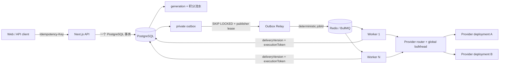

# 商用生成队列架构与运行手册

## 架构结论

生产生成链路采用 **PostgreSQL 业务真源 + Transactional Outbox + BullMQ + 标准 Redis + fenced execution**。Redis 只保存可重建的投递状态，不保存积分、业务请求或最终任务状态。



这不是端到端 exactly-once transport。BullMQ 和 Outbox 都按 at-least-once 设计；真正的“只扣一次、只结算一次”由 PostgreSQL 幂等键、delivery version、execution token 和原子结算 RPC 保证。

## 核心不变量

1. `create_generation_with_credit_debit_v2` 在一个事务内完成：请求幂等校验、租户准入、积分扣减、generation、credit log、Outbox。
2. API 不直接执行 Provider，也不依赖 API 生命周期写 Redis。Redis 短暂不可用时，已提交任务停留在 Outbox，恢复后继续投递。
3. BullMQ payload 只包含 `schemaVersion`、`generationId`、`deliveryVersion`、`deliveryKey`、`availableAt`；业务 payload 只从 PostgreSQL 读取。
4. BullMQ `jobId` 必须严格等于 Outbox `delivery_key`。Relay 重试因此天然去重。
5. Worker 认领、心跳、容量延迟、成功结算和失败退款都必须同时匹配 `delivery_version + execution_token`。陈旧 Worker 无权更新或退款。
6. Provider 满载不是业务失败。任务保存断点、增加 delivery version、写入下一条延迟 Outbox，然后释放 Worker。
7. 数据库按有效订阅服务端判定套餐：Standard 最多 12 个、有效 Business/Premium 订阅的 VIP 最多 30 个用户可见 queued/processing 任务；同租户提交通过 profile 行锁精确串行，不同租户保持并行。受信任的隐藏内部任务不占用户任务额度，但公开 RPC 禁止伪造 `internalTask=true`。
8. VIP BullMQ 优先级为 2、Standard 为 20；Standard 等待满 2 分钟后提升为 5，仍低于 VIP，避免 VIP SLA 被普通积压反转。Outbox claim 仍先按租户轮转，套餐优先级不会破坏 noisy-neighbor 隔离。
9. 生产强制 `GENERATION_QUEUE_MODE=bullmq`、`AI_ROUTER_CAPACITY_MODE=redis`，缺少或非法 `REDIS_URL` 时启动失败。
10. 所有面向用户的路由必须把认证后的 `userId` 和 `generationId` 放入 `AiRouteContext`（生成 Worker 通过 AsyncLocal 自动注入）；缺少租户上下文的直接调用不得作为公开 API 入口，发布前应由路由门禁或审计检查拦截。

## 多图任务生命周期

一次“生成 9 张图”只创建一条可见 `generation`、一笔扣费和一条 Outbox；9 张图是该 generation 内的 9 个可恢复槽位，不是 9 条独立用户任务。Worker 领取父任务后按以下最小值计算槽位并发：`GENERATION_IMAGE_BATCH_CONCURRENCY`、模型启用 deployment 容量之和、用户套餐单任务上限。当前默认是 Standard 2、VIP 4，因此 9 个槽位会分波执行，而不会一次占满整台 Worker。

每个槽位完成后立即持久化媒体 URL、进度、prompt trace 和 checkpoint。Worker 崩溃或租约恢复时，已保存的 canonical media asset 槽位会跳过，只执行剩余槽位。槽位遇到租户容量或供应商容量时，整个父 generation 通过 fenced RPC 增加 delivery version 并重新进入 Outbox；容量等待不消耗业务执行次数，超过 10 分钟才失败退款。

供应商路由最多尝试两个配置好的 deployment。429、502、503、504、网络中断等临时错误可以切换或进入 durable retry；451、参数错误等不可重试错误立即终止。图片请求使用 generation 级幂等键，异步提交拿到 task ID 后只轮询原供应商，不重复 POST。部分槽位成功时保留已生成结果，并按失败槽位计算部分退款；最终结算和退款都必须匹配 `delivery_version + execution_token`。

## Redis 职责边界

BullMQ 负责持久投递、延迟、基础设施重试、stalled recovery 和横向 Worker 调度。Provider capacity 使用同一 Redis 实例的独立 namespace/连接，按 deployment 实现全局并发和滚动 RPM；它不能被 BullMQ 的 queue-level concurrency 取代。

当前实现使用 standalone Redis 主从/托管主实例客户端，不支持直接把 `REDIS_URL` 指向 Redis Cluster 节点并期待自动处理 `MOVED`。文档中的 hash-tag 只保证未来 Cluster 迁移时 Lua key 可同槽，不能替代 `IORedis.Cluster` 客户端。生产应使用单主托管 Redis（带故障转移）并在切换前完成专门的 Cluster 客户端改造与演练。

Redis 必须满足：

- 私网访问，禁止公网暴露 6379；
- `maxmemory-policy noeviction`；
- AOF `everysec` 或托管服务的等价持久化；
- 同区域部署，生产使用 Multi-AZ/自动故障转移；
- TLS 用 `rediss://`，凭据只放服务端 `REDIS_URL`；
- BullMQ、capacity、task cache 使用独立 prefix 和独立非 blocking client；
- 不配置 ioredis `keyPrefix`，BullMQ 统一使用 `BULLMQ_PREFIX`。

本地或单 EC2 可先运行仓库内 Redis：

```bash
cp infra/redis/.env.example infra/redis/.env
# 把 REDIS_PASSWORD 换成至少 32 位随机值
docker compose --env-file infra/redis/.env -f infra/redis/compose.yml up -d
docker compose --env-file infra/redis/.env -f infra/redis/compose.yml exec redis \
  sh -c 'redis-cli --no-auth-warning -a "$REDIS_PASSWORD" CONFIG GET maxmemory-policy'
```

应用配置示例：

```env
REDIS_URL=redis://:percent-encoded-password@127.0.0.1:6379/0
GENERATION_QUEUE_MODE=bullmq
AI_ROUTER_CAPACITY_MODE=redis
PM2_WORKER_INSTANCES=1
BULLMQ_WORKER_CONCURRENCY=64
GENERATION_IMAGE_BATCH_CONCURRENCY=8
BULLMQ_RELAY_BATCH_SIZE=100
BULLMQ_RELAY_CONCURRENCY=8
GENERATION_MAX_ACTIVE_PER_USER=30
GENERATION_EXECUTION_LEASE_SECONDS=45
GENERATION_EXECUTION_HEARTBEAT_MS=15000
```

迁移到 AWS ElastiCache/MemoryDB 或阿里云 Tair/Redis 时，业务代码不变：创建私网、同区域、noeviction、TLS 和持久化实例，更新 `REDIS_URL`，滚动重启 API/Worker，再验证管理端队列健康即可。

## 扩缩容模型

- API 实例只做短事务，可独立横向扩容。
- 多个 Relay 使用 PostgreSQL `FOR UPDATE SKIP LOCKED` 和 lease token 并行发布，不会重复确认他人的租约。
- 每个 Worker 进程并发为 `BULLMQ_WORKER_CONCURRENCY`；总 Worker 执行上限约为 `实例数 × 进程并发`。
- 每个 generation 内部同时发起的图片请求由 `GENERATION_IMAGE_BATCH_CONCURRENCY` 控制，并自动受目标模型所有启用 deployment 的容量总和约束。它不是 Worker 任务并发，不能用它替代 BullMQ 扩容。
- Provider 实际并发由 deployment 级 Redis bulkhead 再次限制。增加 Worker 不会绕过供应商并发/RPM。
- 同一供应商账户的 deployment 通过 `capacityGroup` 共享 account-level 并发 bulkhead；账户级总 RPM 目前仍需在各 deployment 配置中按供应商实际额度收紧，不能仅提高 Worker 或 deployment 并发来突破上游配额。
- 吞吐应通过“增加健康 Provider deployment + 增加 Worker”扩展，而不是无上限提高单 Provider 并发。
- 租户准入限制保护 Redis 和数据库不被 noisy neighbor 灌满；`p_max_active_jobs` 只允许把限制调低，数据库触发器始终执行 Standard 12 / VIP 30 的不可绕过硬上限。
- 用户级 Provider 并发建议 Standard `4` / VIP `8`，同一用户同一 deployment 建议 Standard `2` / VIP `4`，单任务图片并发建议 Standard `2` / VIP `4`。这些是执行层 bulkhead，不替代 Provider deployment 的全局容量。
- 供应商账户通过 `capacityGroup` 共享一个 account-level concurrency bulkhead；同一云账户的多个 deployment 不再分别吃满 24 个槽位。RPM 仍以 deployment 配置为准，若供应商账户有更低的总 RPM，必须在后台按实际额度收紧 deployment 值。
- 图片提交使用稳定 `Idempotency-Key`（generation + 输入摘要），路由层最多跨两个 deployment；异步任务一旦拿到 taskId，不再 failover 到第二个供应商。
- 用户公平等待写入 `tenant_capacity`，不会进入供应商 10 分钟容量超时，也不会因同租户满载误退款；供应商容量才使用 `provider_capacity` 和 10 分钟上限。

当前单机基线为 1 个 Worker、任务并发 64；全局单任务生图配置上限为 8，实际再由套餐限制为 Standard 2 / VIP 4。压测后按 CPU、RSS、数据库连接、Provider 容量和 P95 队列等待共同调整。长图像/视频任务主要是 I/O，不要在 Worker event loop 执行长时间同步 CPU 工作。

### 1000 用户容量基线

“1000 用户”不是并发值。初始容量规划按 5% 用户在峰值同时提交、每人 1 个任务估算，即 50 个并发生成。建议基线：

```text
PM2 Worker 实例             1
单 Worker 并发              64
全局单任务生图并发上限      8（Standard 实际 2 / VIP 实际 4）
理论 Worker active 上限     64
当前 EC2                    2 vCPU / 2 GiB，I/O 型任务基线
Redis                       托管 Redis/Tair/ElastiCache，noeviction
单图片 Provider deployment 24 并发 / 60 RPM / 24 burst
Provider 可用并发总和       同模型所有启用 deployment 容量之和
```

在 `/admin/workers` 发布 `1 / 64 / 8 / 8`（实例 / 任务并发 / 单任务生图 / Relay）后，下次 tag 部署会由发布控制器读取 `worker.runtime.v1`，先在新 release 生成候选 `.env.production`，所有 Redis、数据库契约和 OSS 门禁通过后，再原子切换共享环境并启动 PM2 Worker；任何门禁或健康检查失败都会恢复旧环境和旧 PM2 配置。生产扩容前必须把 Redis 移出单机 loopback，并完成 10k 任务、Provider 429、Worker kill -9 和 Redis 故障转移演练。

手动部署参数优先级固定为：命令行显式参数 > 后台已发布 `worker.runtime.v1` > EC2 共享 `.env.production` > 代码默认值。使用 `scripts/deploy-from-local.sh <tag> 1 64 8` 可在本次发布显式覆盖实例、Worker 任务并发和单任务生图并发；省略参数则应用后台期望配置，不会出现两套配置互相覆盖却无法观测的情况。

Admin 只保存版本化期望配置，不能执行 shell 或直接调用 PM2。页面同时显示期望实例、BullMQ 实际在线实例、总 active 容量和配置漂移；部署控制器是唯一基础设施写入者。

## 重试与恢复语义

| 故障 | 系统行为 | 业务结果 |
|---|---|---|
| API 重复提交 | 相同 Idempotency-Key + 相同 fingerprint 返回原 generation | 不重复扣费 |
| API 事务中断 | PostgreSQL 整体回滚 | 无 generation、无扣费、无 Outbox |
| Redis 不可用 | Relay nack + 指数退避；Outbox 保持 pending | 任务不丢，API 已提交任务等待恢复 |
| Relay add 后、confirm 前崩溃 | lease 到期重领；相同 jobId 去重后补 confirm | 至少一次投递，无重复业务结算 |
| Worker 崩溃 | BullMQ stalled recovery；DB execution lease 到期后新 token 重领 | 陈旧 Worker 被 fence 拒绝 |
| Provider 满载/RPM | 持久 defer，新 delivery 延迟投递，用户只看到排队；真实等待满 10 分钟仍无容量则失败；单次退避不超过 60 秒 | 原子退款 |
| Provider 5xx/网络临时失败 | 单次路由最多跨 2 个 deployment，生成执行最多 2 次；成功槽位从检查点恢复，不重复调用 | 耗尽后原子退款 |
| Redis 数据丢失 | Outbox recovery 对仍 queued 的 published delivery 做安全 redrive | Redis 可从 PostgreSQL 重建 |
| 失败/完成重复结算 | settlement RPC 校验 version/token | 第二次结算报 stale fence |

Provider 非重试业务失败在 PostgreSQL 原子结算/退款后让当前 Bull job 正常结束；Provider fallback、容量等待与临时故障都由状态机生成新的 fenced delivery。只有数据库、Redis、租约或结算本身失败才抛给 BullMQ，并由 execution lease recovery 接管。非法 payload/name/fence 属于 poison message，使用 unrecoverable error 立即进入 failed，避免无意义重试。

## 监控与告警

管理后台同时展示 PostgreSQL Outbox 与 BullMQ 实时状态：

- Outbox：pending、publishing、dead、oldest pending age；
- BullMQ：reachable、latency、workers、waiting、active、delayed、failed；
- Provider：deployment in-flight、RPM、熔断状态、429、成功率、P95；
- Worker：active/completed/deferred/skipped/failed/stalled、RSS、优雅停机结果。

统一模型控制面是图片和视频的实际执行入口：同优先级 deployment 使用加权智能分流，失败按优先级 fallback，Redis 容量租约限制并发/RPM，健康表驱动熔断和半开恢复。异步视频在拿到上游 task_id 后固定 deployment，后续恢复不会切换供应商并造成重复生成。

建议初始告警：

- Redis/BullMQ 不可达或 `workers=0` 持续 1 分钟；
- Outbox dead > 0；
- oldest pending > 60 秒；
- Bull failed 增长或 stalled 在 5 分钟内持续出现；
- queue waiting P95 超过产品 SLO；
- Provider 全部 deployment 不可用、429 > 3%、成功率 < 95%；
- Redis 内存 > 70%、连接数 > 70%、复制延迟或持久化失败。

日志和管理接口不得返回 `REDIS_URL`、host、密码、Provider key 或完整上游响应。

## 上线顺序

当前迁移是 clean-slate、破坏性的：会清空历史 `generations` 与 generation 类型任务投影，但保留用户、余额、订单和 credit ledger（账务行解除 generation 外键）。不要在旧代码仍承载流量时应用。

1. 部署/创建 Redis，确认 PING、`noeviction`、持久化、私网和安全组。
2. 设置 GitHub Actions secret `REDIS_URL`；生产 env 设置 BullMQ/Redis 模式。
3. 进入维护窗口，停止旧 Worker/API 写入。
4. 先备份数据库，再严格按 [Supabase SQL 执行顺序](./supabase-migration-order.md) 应用全部时间戳迁移，最后执行 `20260822100000_generation_service_entitlements.sql`。
5. 用 `get_runtime_contract_version()` 确认精确契约；发布脚本会同时校验 RPC 集合、contract version 与 hash。
6. 部署同一版本 API 与 Worker；部署脚本在切流前强制执行 Redis PING/noeviction、OSS 私有 ACL/镜像、ffprobe 与数据库 contract gate。
7. 验证管理后台：Redis reachable、workers >= 1、Outbox dead=0、mirror/validation/cleanup 无积压。
8. 提交幂等 smoke task，验证 generation/credit log/outbox/Bull job/canonical OSS 结果/退款链路。
9. 运行隔离 Redis 与 PostgreSQL 压测，再逐步提高 Worker 和 Provider 容量。

数据库迁移没有旧队列兼容层，回滚策略是 **应用备份 + roll forward**。Redis 不作为业务真源，必要时可以清空并由 Outbox recovery 重建当前 delivery，但禁止在生产运行通用 `FLUSHDB/FLUSHALL`。

## 压测

### PostgreSQL Outbox claim 规模基准

`claim_generation_outbox` 不再对全部 ready backlog 做窗口排序。pending 和过期 publishing lease 分别通过 partial covering index 最多读取 `min(max(p_limit × 16, 64), 8000)` 个候选，合并后再次严格截断；64 的下限高于单用户 VIP 可见积压上限 30，避免小批量 claim 被一个 noisy tenant 占满。租户 `row_number()` 和公平交错只处理这组有界候选，最后回表执行 `FOR UPDATE OF o SKIP LOCKED`。即使 backlog 达到百万级，单次 claim 的窗口输入也不会超过 8,000 行。

在隔离 PostgreSQL 上运行离线计划基准（脚本只创建 TEMP 表，但造数仍会消耗实例资源）：

```bash
psql "$LOAD_TEST_DATABASE_URL" \
  --set=rows=1000000 \
  --file=scripts/explain-generation-outbox-claim.sql
```

验收 `EXPLAIN (ANALYZE, BUFFERS)`：

- pending 与 expired 分支使用对应 partial index scan，而不是对百万行 ready 集合做 sequential scan；
- 每个分支的实际输出不超过 8,000，`bounded_ready` 和 `WindowAgg` 的实际行数也不超过 8,000；
- 最终排序仍以 `tenant_rank` 优先，同一候选集合中的租户先各取第 1 条、再各取第 2 条，noisy neighbor 不会把一个 claim batch 全部占满；
- 分别以 `p_limit=1/50/500`、不同租户倾斜度记录 execution time、shared buffer hit/read、临时文件与 P95/P99。若出现磁盘 sort，先检查索引是否实际生效和 `work_mem`，不要移除候选上限。

该脚本不连接或修改生产队列表。必须显式使用隔离的 `LOAD_TEST_DATABASE_URL`，禁止针对生产主库执行百万行造数。

压测工具只接受独立的 `LOAD_TEST_REDIS_URL`，拒绝复用生产 `REDIS_URL`，并使用随机 queue/prefix：

```bash
ALLOW_QUEUE_LOAD_TEST=1 \
LOAD_TEST_REDIS_URL=redis://127.0.0.1:6379/15 \
npm run queue:load-test -- \
  --jobs 10000 --workers 8 --concurrency 32
```

完整参数与安全约束见 [BullMQ 压测说明](./bullmq-load-recovery-test.md)。发布门槛应至少包含：0 逻辑重复完成、0 waiting/active/delayed 泄漏、峰值并发不越界、失败重试全部恢复，以及吞吐/P95/P99 达标。
